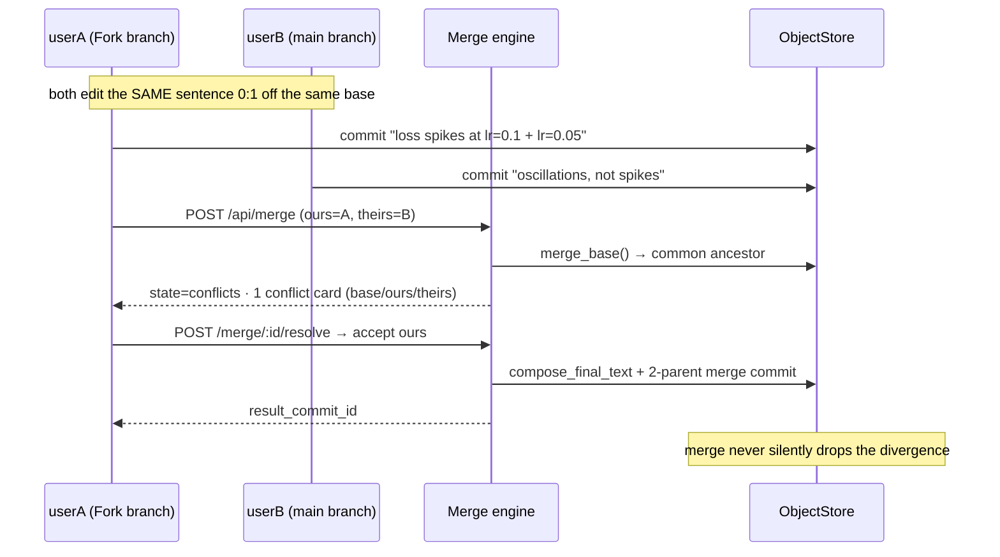

<div align="center">

# ReGit

### Version control, designed for research instead of source code.

*Content-addressed immutable history · sentence-level semantic diff · true 3-way prose merge · CRDT live collaboration · provenance as a primitive · version-aware retrieval*

**No LLM in any correctness path — deterministic algorithms, human-reviewed.**

[](#)
[](https://www.python.org/)
[](https://fastapi.tiangolo.com/)
[](https://react.dev/)
[](https://vite.dev/)
[](https://github.com/y-crdt/pycrdt)
[](#-tests)
[](https://docs.astral.sh/uv/)

*Built for the **Gradient Rush Hackathon** — the AI/ML Club, Scaler School of Technology (SST).*

---

</div>

> "What if Git had been designed for research instead of source code?"

Research today is fragmented across Google Docs, folders of PDFs, GitHub repos, and a dozen throwaway ChatGPT/Claude conversations. Git solved version control for *code* — nobody solves it for *research*, where a "file" is prose with meaning, a chat thread with turn-structure, a PDF with layout, and a claim with provenance. ReGit treats research artifacts as **first-class typed, versioned objects** with a real collaboration + retrieval layer underneath. This is deliberately **not** "Git rebranded with an LLM wrapper" — every correctness path is a deterministic algorithm we own and can explain.

---

## ✨ What it does

| Capability | What you get |
|---|---|
| **Typed ingestion** | Markdown, **ChatGPT** `conversations.json`, **Claude** exports, **PDFs**, and **codebases** — each parsed into a structure-preserving canonical payload, never flattened to a string |
| **Content-addressed versioning** | SHA-256 immutable blobs + merkle commits → one history for prose + chat + PDF + code; same content & parents ⇒ **same commit id** (dedup by construction) |
| **Semantic diff** | LCS over sentence-hashes — shows an *edited claim*, a *moved paragraph*, not a wall of red/green line soup (`git diff` on the same file shows noise) |
| **True 3-way prose merge** | merge-base → per-sentence decision table → conflict cards with Git-exact semantics; resolve → 2-parent merge commit |
| **CRDT live collaboration** | pycrdt (server) ↔ yjs (browser) per artifact+branch; live presence, independent undo, commit-from-live → immutable DAG commit |
| **Provenance as a primitive** | every claim traces `claim ← commit ← artifact ← source` mechanically — "what did we know, and where did it come from" |
| **Version-aware retrieval** | hybrid FTS5 BM25 + Chroma kNN, delta-reindexed per commit, cited results with `introduced_in_commit` + `as_of_commit` time-travel filter |

---

## 🏛 Architecture

```
 Browser (React) — userA / userB, two tabs, one room
   │  REST (/api)            WS (/api/collaborate/:artifact)
   ▼
 FastAPI backend (single uvicorn worker)
 ├─ core/objects      content-addressed blob store · commit DAG · branches
 ├─ core/diff         align.py ── THE shared primitive (LCS over sentence hashes)
 ├─ core/merge        three_way.py ── decision table · conflict records · markers
 ├─ core/collaboration  pycrdt Doc registry · per-artifact lock · commit-from-live
 ├─ ingestion/        per-format parsers → canonical typed payloads
 ├─ retrieval/        chunkers · delta indexer · hybrid search
 └─ provenance/       claim ← commit ← artifact ← source chain
      │
      ▼
 data/  (fully offline — one process)
 ├─ objects/     zlib blobs by SHA-256 prefix
 ├─ meta.db      SQLite WAL: objects/commits/refs/chunks/crdt_ops/conflicts
 └─ vectordb     embedded Chroma + MiniLM-L6-v2 (pre-downloaded at setup)
```

### Why one process, fully offline
The entire demo runs on a single `uvicorn` process with embedded Chroma + SQLite — no separate servers, no network dependency (after a one-time model download). A judge can't be handed "the deployment is down." Scale-up path (Postgres, S3, Redis rooms) is documented in the ADRs but deliberately not built.

### The live merge-conflict demo, as a sequence



---

## 🚀 Quick start

```bash
bash scripts/setup.sh                       # uv sync · pre-download model · init store
uvicorn backend.src.api.main:app --port 8377   # backend + static frontend on :8377

# CLI: python -m backend.src.cli init|commit|log|branch|checkout|diff|merge|verify|ingest

# frontend (dev, with Vite proxy → :8377)
cd frontend && npm install && npm run dev     # :5173
```

---

## 💡 The one-spine insight

One deterministic **alignment engine** (`align.py`) powers **three** subsystems — with one implementation, tested once, it pays off everywhere:

```
                  ┌──────────▶ semantic diff
  align(base, a) ─┼──────────▶ 3-way merge (base, ours, theirs)
  (LCS over       │
  sentence hashes)└──────────▶ retrieval delta-reindex (changed sids → changed chunks)
```

Sentence → normalize → hash → **LCS over sentence-hash sequences** → classify `equal / edited(≥0.7) / delete / insert / moved`. This is the piece that makes the system feel purpose-built for research rather than bolt-on.

---

## 🧪 Tests

**120+ tests passing** across unit + integration suites — deterministic (pinned fixtures + `GR_AUTHOR_DATE`), covering every invariant:

| Invariant under test | Where |
|---|---|
| Object store append-only + immutability triggers | `tests/unit/test_invariants.py` |
| Merge never silently discards a divergence | `tests/unit/test_invariants.py` |
| CRDT convergence under shuffle/dup/out-of-order | `tests/unit/test_collab.py` |
| Provenance chain across commits | `tests/unit/test_invariants.py` |
| Live merge conflict → resolve → 2-parent commit | `tests/integration/test_merge_flow.py` |
| Two-client WS relay over a real uvicorn server | `tests/integration/test_collab_ws.py` |
| Hybrid search + `as_of_commit` time-travel | `tests/integration/test_retrieval_vector.py` |

```bash
uv run python -m pytest tests/ -q    # run everything
```

---

## 📚 Documentation

| Doc | What it's for |
|---|---|
| [`docs/EXPLAINER.md`](docs/EXPLAINER.md) | **Start here** — the whole project told as a mentorable story: problem, architecture, how each piece works, two walked-through demos, 30/60/90s pitches |
| [`docs/architecture.md`](docs/architecture.md) | Locked system architecture + layer boundaries |
| [`docs/data-model.md`](docs/data-model.md) | Exact schemas + core invariants |
| [`docs/adr/`](docs/adr/) | 14 Architecture Decision Records (every non-trivial choice, with alternatives + tradeoffs) |
| [`docs/specs/`](docs/specs/) | API contract, realtime protocol, and per-subsystem specs (versioning/diff/merge/collaboration/provenance/retrieval/ingestion) |
| [`docs/demo/`](docs/demo/) | The 5-minute demo script + judge Q&A |
| [`docs/CHANGELOG.md`](docs/CHANGELOG.md) | Spec-vs-implementation drift notes |

---

## 🔒 Security posture (honest scope)

**Protected:** path traversal (ingestion paths normalized + contained), blob tamper detection (`gr verify`), parameterized SQL only.
**Deliberately out of scope (per the 13h brief):** auth — mock `X-User` header; OCR — text-extractable PDFs; custom vector DB — embedded Chroma; untrusted-content / prompt-injection handling (no LLM consumes imported docs in any correctness path).
**Secrets:** none required, no API keys needed to run.

---

## 🤖 AI usage

Boilerplate — scaffolding, parsers, UI components, tests — is agent-generated **under human-owned, human-reviewed specs** (ADR-14). All *algorithms* (diff, merge, CRDT, retrieval, provenance) are deterministic, covered by invariant tests, and owned by the humans on the team. The engine is not an LLM wrapper; the LLM was a (fast, cheap) implementer, not the correctness path.

---

## ✅ What was & wasn't completed

**All four mandatory pillars + stretch, implemented and tested:**

- ✅ **Ingestion** — Markdown, ChatGPT, Claude, PDF, codebase
- ✅ **Versioning** — content-addressed DAG, branches, semantic diff, 3-way merge
- ✅ **Concurrency** — CRDT live editing, presence, commit-from-live
- ✅ **Retrieval** — hybrid search, citations, time-travel
- ✅ **Stretch** — 3-way prose merge **with conflict-resolution UI**, provenance chain, time-travel query

**Deliberately not pursued (per brief scope or time):** real auth, OCR, custom vector DB, cross-artifact claim propagation, multi-agent editing branches — the last two are the leading candidates for "next."

---

## 🚢 What we'd build next, given more time

Treat research as a **claim graph**, not just a version tree. Today every claim carries lineage (provenance) but it's read-only. Next we'd make it *actionable*: **(1) cross-artifact propagation** — a changed source-PDF claim auto-flags every downstream doc that cited it, with a one-click "re-verify" diff; **(2) claim-level semantic merge** — resolve conflicting claims by their *sources* (ours-cites-ChatGPT, theirs-cites-a-paper) instead of just their text; **(3) agent branches** — let an LLM draft a hypothesis on its own branch for human merge review, using the CRDT lock + 3-way merge as the review boundary; **(4) true historical rewind** — retrieval returns literal byte-content as of commit X, not just "claims introduced by X." The one-spine design + invariants already carry these without rearchitecting.

---

<div align="center">

**ReGit** · built by **Muneer Alam** & **Amrit Kang** · *Gradient Rush Hackathon 2026, SST AI/ML Club* · [MIT License](LICENSE)

</div>